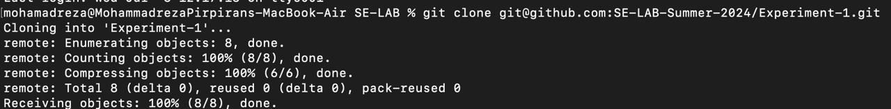
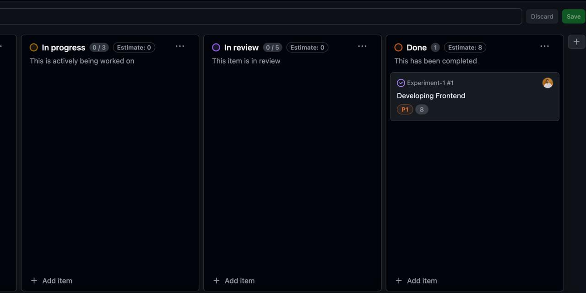
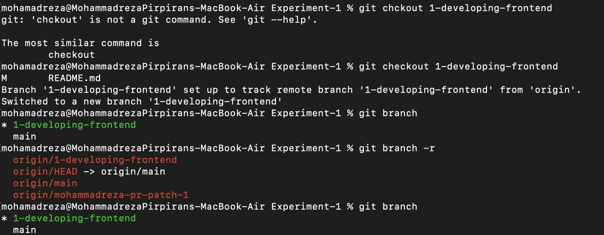
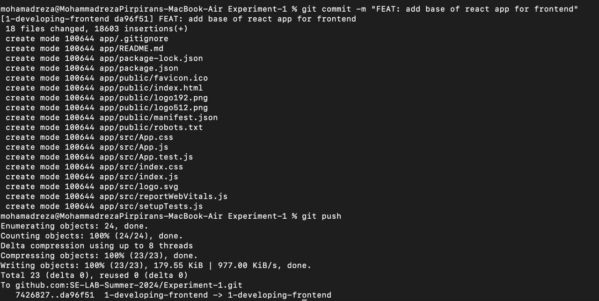
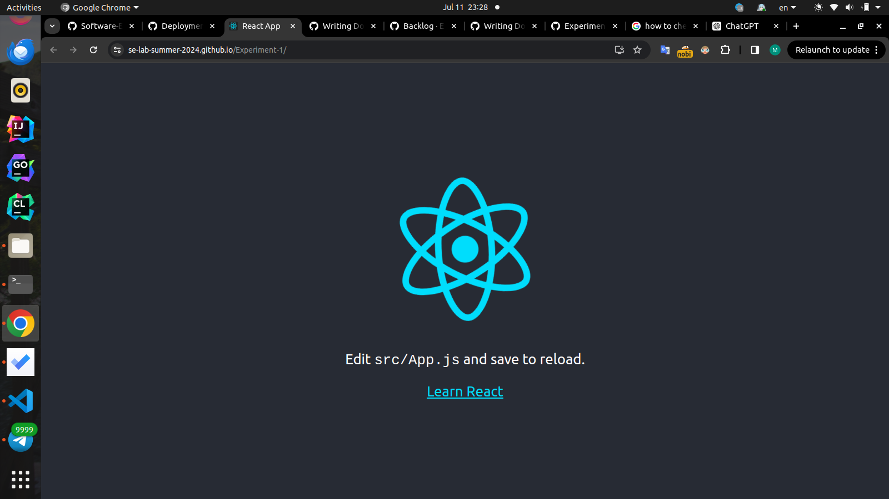

# گزارش آزمایش

## گزارش پروژه

در ابتدا تمامی لینک های گذاشته شده را به خوبی مطالعه کردیم تا بتوانیم پروژه را مطابف اصول چابک به درستی پیش ببریم و از مخزن گیت به خوبی استفاده کنیم.

در مرحله بعدی , از لینک داده شده مخزن گیت را clone کردیم و پروژه را شروع نمودیم.

در ادامه برای پیشبرد پروژه یک TaskList از قسمت پروژه در گیتهاب ایجاد کردیم تا بتوانیم تسک های مختلف را ایجاد و مدیریت کنیم .در ادامه برای هر تسک یک issue ایجاد کردیم.

برای هر issue یک branch جدا ایجاد کردیم تا بتوانیم به نحو احسن ورژن های مختلف را جلو ببریم و در نهایت آنها را merge کردیم. وضعیت هر کدام از issue ها بعد از انجام شدن به حالت بسته تغییر داده می شد.

با استفاده از commit های مختلف توانستیم مرحله به مرحله پروژه را جلو ببریم و در نهایت مدیریت مناسبی بر روی قسمت های مختلف داشته باشیم. همچنین تغییرات مختلف را ذخیره کرده و درصورت نیاز به عقب برگشتیم.

در نهایت پروژه مد نظر به خوبی پیاده شد و لینک آن در بخش Deployment قرار گرفت که می توان آن را مشاهده کرد.

## سوالات
۱. پوشه .git یک دایرکتوری در پروژه است که Git از آن برای ذخیره تمام اطلاعات مخزن ما استفاده می کند . این شامل مواردی مانند commit ها، شاخه ها، برچسب ها و سایر اطلاعاتی است که Git برای ذخیره تاریخچه پروژه استفاده می کند.

۲. منظور از atomic بودن مرج ریکویست یا کامیت این است که هر مرج ریکویس یا هر کامیت دقیقا یک کار را انجام می دهد و ان کار را به صورت کامل انجام میدهد و باعث نمی شود بعد از ان پروژه اجرا نشود و پروژه بعد از آن نیمه کاره نمی ماند.

۳. هر کدام را جداگانه توضیخ میدهیم :
الف ) fetch : فتچ کردن به معنای دانلود کامنت ها و تغییرات ریپازیتوری بر روی سیستم خودمان می باشد ولی fetch کردن باعت تغییر فایل هایی که در حال کار بر روی آن ها هستیم نمی شود.
ب ) merge : به معنای ادغام کامیت های دانلود شده در fetch با فایل هایی که در حال کار با آنها هستیم می باشد .
ج ) pull : این دستور همانند اجرای دو دستور قبلی یعنی اول fetch و سپس merge می باشد و تغییرات را ابتدا دانلود می کند و سپس ادغام میکند.
د ) rebase : همانند دستور merge یک برنچ را در دیگری ادغام می کند با این تفاوت که هیستوری commit های برنج اول از بین میرود و کاملا با برنچ جدید جایگزین می شود.
ه ) cherry pick : این امکان را می دهد که یک commit را از یک شاخه انتخاب کنید و آن را در شاخه دیگر اعمال کنید. این برای اعمال تغییرات بدون ادغام کل تاریخچه یک شاخه مفید است.

۴. هر کدام را جداگانه توضیح میدهیم.
الف ) reste: شاخه فعلی را به عقب (یا جلو) به commit مشخص شده منتقل می‌کند و به صورت اختیاری index یا فهرست کاری را تغییر می‌دهد تا مچ بشود.
ب ) revert :  یک commit جدید ایجاد می کند که تغییرات ایجاد شده در یک commit مشخص شده را بدون تغییر در تاریخچه پروژه لغو می کند.
ج ) restore : برای بازیابی فایل های working tree استفاده می شود. می تواند تغییرات staging را لغو کند و به صورت اختیاری مسیرهای مشخص شده را در یک commit معین به نسخه برگرداند.
د‌ ) switch : یک دستور نسبتاً جدید که با به‌روزرسانی دایرکتوری کاری، برنچ را تغییر می‌دهد و به‌صورت اختیاری برخی از مسیرها را در مسیر فعلی به‌روزرسانی می‌کند.
ه ) checkout : برای جابجایی بین برنچ ها یا بازیابی فایل های دایرکتوری مورد استفاده می شود. در نسخه های جدیدتر Git تا حدی توسط دستورات سوئیچ و restore جایگزین شده است.

۵. استیچ یا ایندکس : استیج یا ایندکس در Git یک مرحله‌ است که Git تغییراتی را که قرار است انجام شوند ذخیره می‌کند. تغییرات اضافه شده به ایندکس، تغییراتی هستند که در commit بعدی گنجانده می شوند. این به توسعه دهندگان اجازه می دهد تا به طور انتخابی انتخاب کنند که کدام تغییرات را انجام دهند.
استش یا Stash فرمانی است که به طور موقت تغییرات را پنهان می کند تا بتوانید روی یک کار متفاوت کار کنیم

۶. در Git، یک snap shot به وضعیت مجموعه ای از فایل ها در یک نقطه خاص از زمان اشاره دارد. هنگامی که یک commit می کنیم، Git اساساً یک snap shot از فایل ها در آن لحظه می گیرد و یک رفرنس به آن می دهد. اگر فایل‌ها تغییر نکرده باشند، Git فایل را دوباره ذخیره نمی‌کند، فقط یک پیوند به فایل مشابه قبلی که قبلاً ذخیره کرده است. commit ها در Git به جای تفاوت یا دلتا به عنوان snap shot در نظر گرفته می شوند.

۷.هر کدام را به ترتیب داریم:
الف ) Local Repository: یک پروژه versoin-controled در سیستم ما است که توسط Git مدیریت می شود. این شامل تمام تاریخچه ها، commit ها، برنچ ها و تگ های لازم برای کنترل نسخه است.
ب )  Remote Repository: برای همکاری تیمی در اینترنت می باشد. این به چندین توسعه‌دهنده اجازه می‌دهد تا به ریپازیتوری اصلی پوش بکنند و از آن خارج شوند و توسعه مشارکتی را ممکن می‌سازد. GitHub، GitLab و Bitbucket نمونه‌هایی از ریپازیتوری های انلاین هستند.
